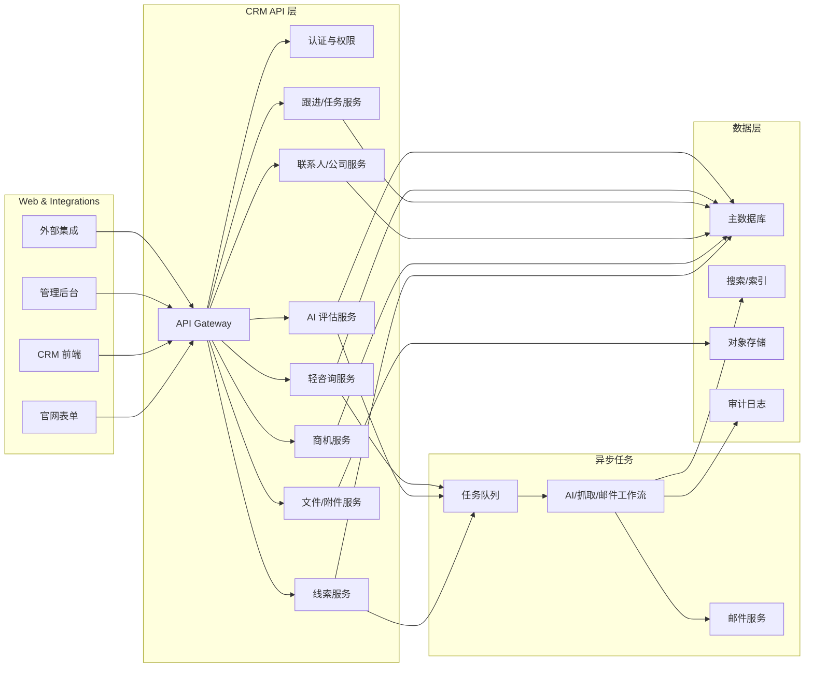

# CRM 系统架构

总体架构

```mermaid
flowchart LR
  subgraph Web["Web & Integrations"]
    PublicSite["官网表单"]
    CRMWeb["CRM 前端"]
    AdminWeb["管理后台"]
    Integrations["外部集成"]
  end

  subgraph API["CRM API 层"]
    Gateway["API Gateway"]
    Auth["认证与权限"]
    Leads["线索服务"]
    Deals["商机服务"]
    Contacts["联系人/公司服务"]
    Activity["跟进/任务服务"]
    Consulting["轻咨询服务"]
    AIService["AI 评估服务"]
    Files["文件/附件服务"]
  end

  subgraph Data["数据层"]
    DB["主数据库"]
    Search["搜索/索引"]
    FilesStore["对象存储"]
    Audit["审计日志"]
  end

  subgraph Async["异步任务"]
    Queue["任务队列"]
    Workers["AI/抓取/邮件工作流"]
    Mailer["邮件服务"]
  end

  PublicSite --> Gateway
  CRMWeb --> Gateway
  AdminWeb --> Gateway
  Integrations --> Gateway

  Gateway --> Auth
  Gateway --> Leads
  Gateway --> Deals
  Gateway --> Contacts
  Gateway --> Activity
  Gateway --> Consulting
  Gateway --> AIService
  Gateway --> Files

  Leads --> DB
  Deals --> DB
  Contacts --> DB
  Activity --> DB
  Consulting --> DB
  AIService --> DB
  Files --> FilesStore

  Leads --> Queue
  AIService --> Queue
  Consulting --> Queue

  Queue --> Workers
  Workers --> Mailer
  Workers --> Search
  Workers --> Audit
```

关键设计原则
- 模块化：CRM 与 AI 评估、新媒体营销系统可独立部署。
- 多租户与品牌隔离：行级隔离，防止跨品牌可见。
- 低耦合：CRM 核心与营销系统、评估系统通过 API 或事件联动。
- 可审计：关键行为写入审计日志。

部署形态建议
- 单体优先，模块化拆分保留。
- AI 评估与新媒体营销后续可独立为服务。

