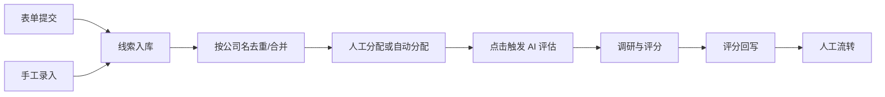
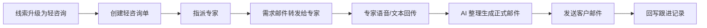
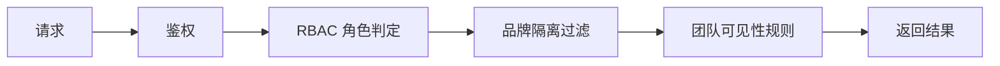

# 关键流程

线索进入与 AI 评估

```mermaid
flowchart LR
  A["表单提交"] --> B["线索入库"]
  C["手工录入"] --> B
  B --> D["按公司名去重/合并"]
  D --> E["人工分配或自动分配"]
  E --> F["点击触发 AI 评估"]
  F --> G["调研与评分"]
  G --> H["评分回写"]
  H --> I["人工流转"]
```

轻咨询流程

```mermaid
flowchart LR
  A["线索升级为轻咨询"] --> B["创建轻咨询单"]
  B --> C["指派专家"]
  C --> D["需求邮件转发给专家"]
  D --> E["专家语音/文本回传"]
  E --> F["AI 整理生成正式邮件"]
  F --> G["发送客户邮件"]
  G --> H["回写跟进记录"]
```

权限与品牌隔离

```mermaid
flowchart LR
  A["请求"] --> B["鉴权"]
  B --> C["RBAC 角色判定"]
  C --> D["品牌隔离过滤"]
  D --> E["团队可见性规则"]
  E --> F["返回结果"]
```
